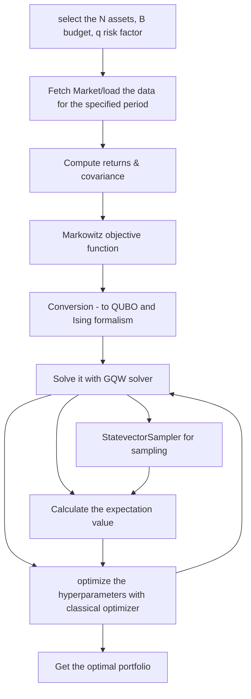

## Guided Quantum walk for portfolio optimization

  

**This project is an effort to extend the guided quantum walk and compare it with other state-of-the-art quantum algorithms such as VQA and QAOA to the famous financial problem called portfolio optimization.**

- This project also focuses on the necessary financial aspect for building portfolio such as computing historical-mean returns, risk-volatility, sharpe ratio and many more.

- requirements.text will contain all the necessary packages.

  

## Introduction

  

When it comes to finance, one such optimization problem is portfolio optimization, where

the task is to minimize/maximize the trade-off between the risk and the returns for a

given investment strategy with some constraints like the budget for a set of assets or

the process of selecting the set of assets and their quantities from a pool of assets being

considered.

  

## Problem Statement

  

On the core of our algorithm we are trying to solve one key mathematical formulation:

$$

\mathcal{L}(x) : x^T \mu - q x^T\Sigma x

$$

- $q$ is the risk aversion coefficient, which is a scaling factor that weights the constraints

satisfaction with respect to the objectives and is a way to express the propensity to risk

of the investor.

- $\mu$ is the expected mean vector.

- Similarly, the variance of each asset return and the covariance between returns of different

assets form the covariance matrix $\Sigma$.

  

## The main algorithm flow

  

note: to run this algorithm for this project, the end user need not to the complete flow, just run the cells as provided in the `main/notebooks/example.ipynb`

  
  

---

  

## Benchmarking

  

For benchmarking the GQW solver against one quantum algorithm (we'll use the standard) and a classical solver (`scipy.minimize`). \\

This comparison is done for 5 assets where the circuit is classically simualted for 1 - 3 - 5 reps. \\

For the approximation ratio we will be using this formula \\

$$

    \text{Appr. ratio} = \frac{C_{algo}}{C_{optimal}}

$$

$C_{optimal}$ is the optimal solution computed by the classical solver which was found to be -0.3677338029925057.

  

| Algorithm | Energy Level | Approximation Ratio | Circuit Depth |

|----|---|---|--| 

| Standard QAOA | -0.36773380299250635 | 1| 31 |

| Guided Quantum Walk | -0.36773380299250635| 1 | 52 |

  

The assets taken into the consideration can be found in `main/notebooks/example.ipynb`

It is to be noted the the the approximation being close to 1 is because the assets we have taken is just 5 and the algorithm is only tested with classical simulation with qiskit's `StateVectorSimulator()`.\\

The real comparison in the solution quality will be done only when these algorithms will be run in the real quantum hardware by IBM's runtime

  

### Plot convergence

  

  

As seen in this plot, as the reps for the QAOA increases the optimizer steps increases as it as solve for 2*reps parameters. \\

Whereas the GQW performs well converging to the solution for the fixed set of hyperparameters.

  

## How to use it

  

- git clone `https://github.com/farhan2418/quantum_portfolio_optimization.git`

- run the command `pip install -r requirements.txt`

- follow the steps as provided in `main/notebooks/example.ipynb`

  

#### Happy Coding!